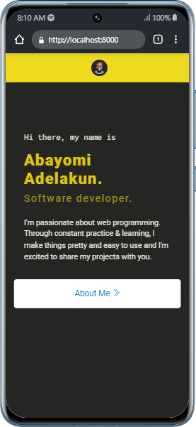

# CV Mobile App

## Table of contents

- [Overview](#overview)
- [My process](#my-process)
  - [Built with](#built-with)
  - [Screenshot](#screenshot)
- [Author](#author)

## Overview
 - This is is a Portfolio App created by me using Cordova. This is my first mobile development project. 

## My process
- As an assessment to build a CV App, After setting up my environment for cordova, I then sketch on paper how the UI will look. 
- Having idea of portfolio and CV, I implemented the idea here. 
- By adding App.js file, Jquery file, I was able to route to next page, also I use some Javascript function.

### Built with
- Html
- CSS custom properties
- Flexbox
- CSS Grid
- Boostrap
- JavaScript (jquery)

### Screenshot

## Author

- Website - [Adelakun Abayomi](https://adelakunportfolio.netlify.app/)
- GitHub -  [@thisisadelakun](https://github.com/thisisadelakun)
- Twitter - [@thisisadelakun](https://www.twitter.com/thisisadelakun)
